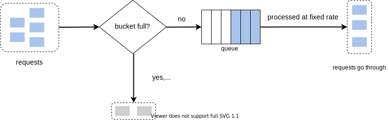

- A rate limiter can either be at the client or the server side
	- Client-side implementation
		- Client is an unreliable place to enforce rate limiting because client requests can be forged by malicious actors.

- As an alternative, we can also create a rate limiter middleware.
- 
- Due to the popularity of cloud microservices, rate limiting is usually implemented within a component called API gateway
- If your system already uses microservice architecture and includes an API gateway to perform authentication, IP whitelisting, etc, it is better to add the rate limiter to the API gateway instead of implementing it in the server
- Token bucket algorithm
	- A token bucket is a container that has pre-defined capacity.
	- Tokens are put in the bucket at preset rates periodically.
	- Once the bucket is full, no more tokens are added.
	- Each request consumes one token. When a request arrives, we check if there are enough tokens in the bucket.
	- If there are enough tokens, we take one token out for each request, and the request goes through.
	- If there are not enough tokens, the request is dropped.
	- Example: 
	- The number of buckets can be decided on the requirements. One bucket means one rate limiting rule. For example, if you want to throttle based on IP addresses, we require one bucket per IP address
	- Pros
		- Easy to implement
		- Memory efficient
		- Allows a burst of traffic for short periods
	- Cons
		- Challenging to tune the bucket size and token refill rate
- Leaking bucket algorithm
	- Similar to the token bucket algorithm, except that the requests are processed at a fixed rate.
	- Implemented with a first-in-first-out (FIFO) queue
	- How it works? 
	- Pros:
		- Memory efficient due to the limited queue size
		- Suitable for cases where stable processing rate is desired
	- Cons
		- Not suitable for a burst of traffic
		- Difficult to tune the two parameters: Bucket size, Outflow rate
- Fixed window counter algorithm
	- Divide the timeline into fix-sized time windows.
	- Assign a counter for each window. Counter is reset at the start of each window
	- Each requests increments the counter by one
	- After the counter reaches the threshold, new requests are dropped
	- Cons
		- Spike in traffic at the edges of a window can cause more requests than the allowed quota to go through
		- 
			- The system allows a maximum of 5 requests per minutes, and the counter resets at the human-friendly round minute
			- There are 5 requests just before 2:01, and 5 requests just after 2:01.
			- This leads to 10 requests going through around the 2:01 mark
	- Pros
		- Memory efficient
		- Simple and easy
- Sliding window log algorithm
	- How it works (assuming a limit of 5 requests per minute)
		- Every time we receive a request, we check if we have received 5 or more requests in the last 1 minute
		- When a request is received, its timestamp is logged. This logging of timestamp helps us count the number of requests received in the last minute
		- ![[Pasted image 20230609085817.png|Sliding window log algorithm]]
		- Pros
			- Accurate rate limiting due to the rolling window
		- Cons
			- Memory intensive
- Sliding window counter algorithm
	- 