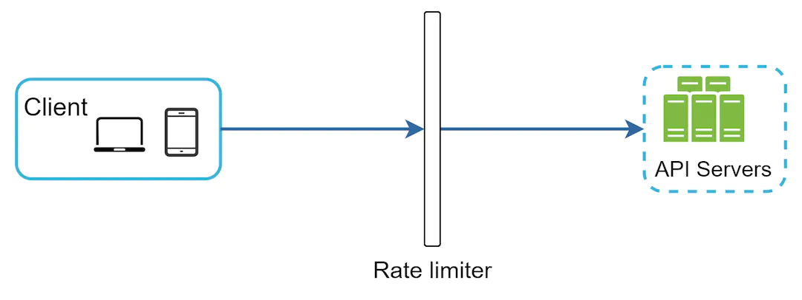

- A rate limiter can either be at the client or the server side
	- Client-side implementation
		- Client is an unreliable place to enforce rate limiting because client requests can be forged by malicious actors.

- As an alternative, we can also create a rate limiter middleware.
- 
- Due to the popularity of cloud microservices, rate limiting is usually implemented within a component called API gateway
- If your system already uses microservice architecture and includes an API gateway to perform authentication, IP whitelisting, etc, it is better to add the rate limiter to the API gateway instead of implementing it in the server
- Token bucket algorithm
	- A token bucket is a container that has pre-defined capacity.
	- Tokens are put in the bucket at preset rates periodically.
	- Once the bucket is full, no more tokens are added.
	- Each request consumes one token. When a request arrives, we check if there are enough tokens in the bucket.
	- If there are enough tokens, we take one token out for each request, and the request goes through.
	- If there are not enough tokens, the request is dropped.
	- Example: 