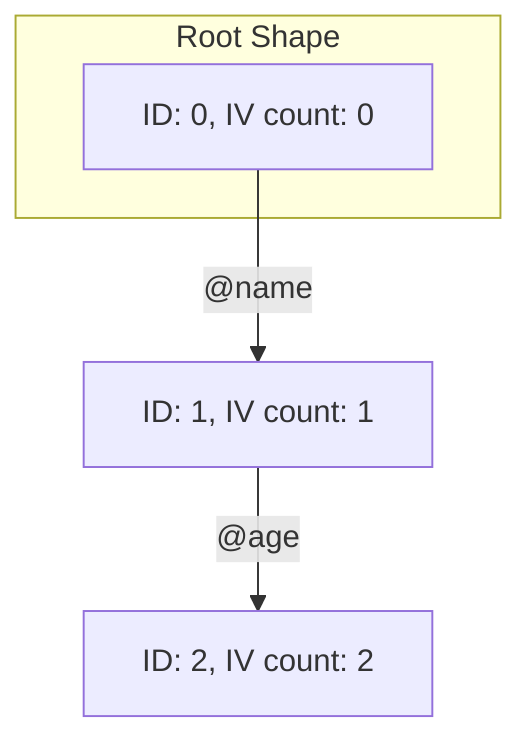
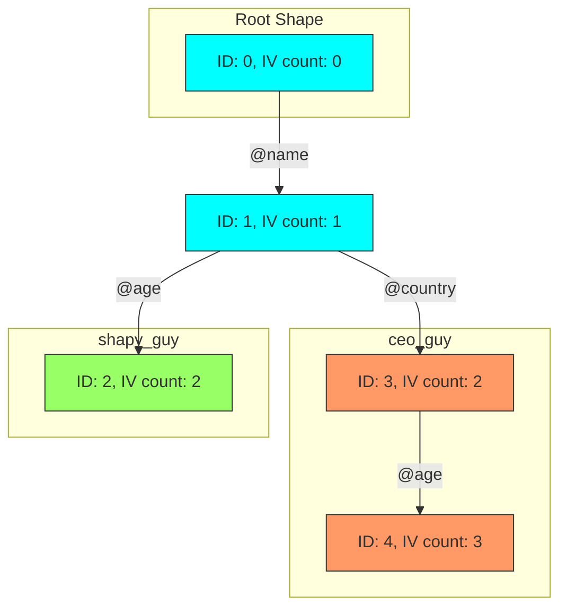

There is an almost non-descript bullet point in the Ruby 3.2.0 changelog which states:

> YJIT is now optimized to take advantage of object shapes. [[Feature #18776](https://bugs.ruby-lang.org/issues/18776)]

Before discussing what object shapes are and how they boost your code performance, let’s look at how things have been before this release. This will help you understand the problem it is trying to solve.

## Pre-ruby 3.2.0

### How does Ruby store an object’s instance variables?

Every plain ruby object is assigned 40 bytes of space(on a 64-bit machine). The in-memory layout of an embedded ruby object looks like:

| Byte index | Value |  |
| --- | --- | --- |
| 0 | Flags (64-bit bitmap) |  |
| 8 | Pointer to class |  |
| 16 | First instance variable (IV) | IV array → Index: 0 |
| 24 | Second instance variable (IV) | IV array → Index: 1 |
| 32 | Third instance variable (IV) | IV array → Index: 2 |

As you can see, the values of instance variables (IVs)[^1] of an object are stored inside the object’s memory space itself[^2]. The bytes where the instance variables are stored collectively form an array called the **instance variable array, or IV array.**

As an example, consider the following class:

```ruby
class Person
	attr_accessor :name, :age, :country
end

demo_guy = Person.new
```

This is how the memory layout of `demo_guy` will look like:

| Byte index | Value |  |
| --- | --- | --- |
| 0 | Flags (64-bit bitmap) |  |
| 8 | Pointer to class (`Person`) |  |
| 16 | Qundef (undefined) | IV array → Index: 0 |
| 24 | Qundef (undefined) | IV array → Index: 1 |
| 32 | Qundef (undefind) | IV array → Index: 2 |

The array indices map to the instance variable names using a hash table called **IV index table.** This table is specific to the class (`Person` in this case) of the object, not the object.

So, when setting the `name` attribute (`@name`) on this object, the interpreter first queries the IV index table to get the IV array index for `@name`. If the index is not present, the next available index is assigned to `@name`. After running this command, 

```ruby
demo_guy.name = "Alice"
OR
demo_guy.instance_variable_set(:@name, "Alice")
```

The IV index table looks like:

| Instance variable name | Index |
| --- | --- |
| @name | 0 |
|  |  |

And the IV array looks like this:

| IV array index | Value |
| --- | --- |
| 0 | "Alice" |
| 1 | Qundef (undefined) |
| 2 | Qundef (undefind) |

This is how the IV index table and IV array change after setting of each instance variable:


Transition of IV index table and IV array as instance variables get set

As you can guess, all objects of a class share the same IV index table. A new `Person` object can use the index values already created in the IV index table.

### Hash lookups are slow; Inline caches to the rescue

Even this hash lookup is considered slow when instance variables are constantly set and read, which is common in a typical Ruby codebase. So, the ruby interpreter (YARV) creates inline caches[³](https://www.notion.so/Ruby-3-2-0-introduces-object-shapes-33309b579dba4d27b7c7dc5368796549) to store the array indices within the getter and setter byte code.

For example, after setting `@name` the array index `0` is cached inline within the setter method. It will look something like this (pseudo-code):

```ruby
def name=(value)
	cached_index = cache.index(:@name)
  iv_array[cached_index] = value
end
```

When the index is fetched for the first time, the inline cache is empty. It references the IV index table to get the index and update the inline cache.

This inline cache uses the class of the object as its cache key[⁴](https://www.notion.so/Ruby-3-2-0-introduces-object-shapes-33309b579dba4d27b7c7dc5368796549). The above code will be updated into this (pseudo-code):

```ruby
def name=(value)
  if self.class.name == cache.key # cache.key = Person
	  index = cache.index(:@name)
	else
		index = lookup_index_table(:@name) # Lookup the index from IV index table
		# Setting the inline cache with the object's class as cache key
		cache[self.class.name] = { index: index }
	end
	iv_array[cached_index] = value
end
```

### The problem - Dependency of object attributes to class

Consider a new class inheriting from `Person`:

```ruby
class Child < Person
end

kid = Child.new
kid.name = "Bunty"
```

The interpreter won’t be able to use the inline cache since the class of the object `kid` is not `Person`. It will reference the IV index table of `Child` class to get the IV index for `@name` and update the inline cache key to `Child`.

Next time if `@name` is referenced on an instance of `Person`, the interpreter will again miss the cache since the cache key will now be `Child`. It will again do a lookup on the `Person` IV index table and update the inline cache key to `Person`.

You can appreciate the problem even more by reasoning that the code below will never be able use make use of the inline cache.

```ruby
loop do
	demo_guy.name
	kid.name
end
```

A typical ruby codebase is full of class inheritances and instances referring to methods defined in their parent classes. We can appreciate the scale of the problem.

## Object Shapes

As the authors of this feature have repeatedly pointed out in their presentations, they are not the regular geometrical shapes. They are an abstract concept to describe an object. They are just tree data structures.

The shape of an object is defined by its properties (attributes). *To limit the scope of this post, we will focus solely on instance variables as part of an object’s attributes.*

### Implementation of object shapes

There is one global shape tree. The shapes form the nodes of the tree and the instance variables which create those shapes form the edges. There is one root shape which represents a basic object with default properties only.

Using the classes we defined above, consider a new instance of `Person`:

```ruby
shapy_person = Person.new
```

`shapy_person` does not have any properties explicitly set. So, it will have the root shape. For the sake of simplicity, the `shape_id` of the root shape will be considered to be `0`. Each time an instance variable is set on `shapy_person`, it transitions to a new shape.

```ruby
shapy_person.name = "Alice" # Transitions to a new shape with ID: 1 via edge @name
shapy_person.age = 20 # Transitions to a new shape with ID: 2 via edge @age
```

It transitions to shape with `ID: 1` and edge `@name` when `@name` is set. Then, it transitions to a shape with `ID: 2` and edge `@age` when `@age` is set.



The shapes are independent of the values of the instance variables. So, if the value of `@name` is changed, the shape still remains the same.

New objects with the same transitions will end up with the same shape. This is independent of the class of the object. This also includes the child classes since they, too, can re-use the shape transitions of the parent class. But, two objects can share the same shape only if the order in which their instance variables are set are the same. This is demonstrated in the code snippet below.

```ruby
class Car
	attr_accessor :name, :age
end

my_car = Car.new # Shape ID: 0
my_car.name = "Tesla S" # Shape ID: 1
my_car.age = 1 # Shape ID: 2
```

Consider this scenario:

```ruby
ceo_guy = Person.new # Shape ID: 0
ceo_guy.name = "Elon" # Shape ID: 1
ceo_guy.country = "South Africa" # Transitions to shape ID: 3 with edge @country
ceo_guy.age = 51 # Transitions to shape ID: 4 with edge @age
```

The diagram below shows the transitions involved. Blue represents the shared transitions, green represents transitions for `shapy_guy` only and orange represents transitions for `ceo_guy` only.  



As can be seen, the index of the instance variable that represents the incoming edge of a shape is given by `IV_count - 1`. For example, shape with `ID: 1` is created by `@name` and has `IV count: 1`.  It is the first variable to be set on the root shape. The index of `@name` in an object which has gone through shape with `ID: 1` will be `0` . This pattern continues further down the shape tree giving us the expression: `iv_index = iv_count - 1`.

### How does the current shape of an object provide the index of all instance variables of the object?

Every shape contains information the edge that created it and its parent shape. So, shape with `ID: 4` knows that it has been created by the instance variable `@age` and its parent shape is shape with `ID: 3`. 

To know the index of any instance variable, we walk up the shape tree and find the shape whose parent edge is represented by the instance variable whose index we need. Then the index is simply `1` less than the `IV count` of the shape.

For example. if we need the index of `@name` for `ceo_guy`, we walk up the shape tree following the edges belonging to `ceo_guy` and end our search on shape with `ID: 1`. This gives us the index of `@name`.

If no shape is found in the shape tree, a new shape is created from the current shape to store the instance variable being set in the object.

Walking up the tree to find the index of an instance variable looks like an even more expensive process as compared the index table lookup in pre-3.2.0 ruby. But, this cost is amortised when we consider that most objects of a class usually set their instance variables in the same order and the usage of inline cache similar to pre-3.2.0 ruby.

### Caching using object shapes

When setting an instance variable, we can check if there is an outgoing edge from the current shape that represents the name of the instance variable. This gives us the `ID` of the next shape the object should transition into and the index where the value of the instance variable should be stored in the IV array. In contrast to pre-3.2.0 ruby, object shapes make this mechanism independent of the class of the object.

After an instance variable is set for the first time, an inline cache is created in the setter. The inline cache has the `shape_ID` from before the transition as the cache key. We can also consider this to be the current shape ID of the object. The value of the cache holds the following values:

1. Shape ID before the transition
2. Shape ID after the transition
3. `iv_index`: Index in the IV array where the value of the instance variable should be stored

```ruby
# Pseudo-code demonstrating inline cache using object shapes
#
def name=(name)
	@name = name # cache_key: 0 => current_shape_ID: 0, next_shape_ID: 1, iv_index: 0
end

def age=(age)
	@age = age # cache_key: 1 => current_shape_ID: 1, next_shape_ID: 2, iv_index: 1
end

ic_person = Person.new
ic_person.name = "Kabir" # creates the inline cache
ic_person.age = 56 # creates the inline cache
```

After the cache has been created, a new object that tries to set the instance variable will be able to use the defined cache if its `shape_id` matches the `shape_ID` of the cache key. For instance: 

```ruby
person2 = Person.new # shape_id: 0
person2.name = "Alice" # shape_id: 1
person2.age = 40 # shape_id: 2
```

Here, `person2` will be able to re-use the cache and does not have to refer the shape tree to get the appropriate `iv_index`.

When trying to read an instance variable, the interpreter looks at the shape tree to get the `iv_index` for the first time. It, then, creates an inline cache where the cache key is the current shape ID and the cache values are:

1. Current shape ID
2. `iv_index`: Index in the IV array where the value of the instance variable is stored

Continuing from the example of `ic_person` above:

```ruby
# Shape ID of ic_person at this point is 2
#
def age
	@age # cache_key: 2 => current_shape_ID: 2, iv_index: 1
end

def name
	@name # cache_key: 2 => current_shape_ID: 2, iv_index: 0
end
```

Now, any object that tries to read the instance variables can use the cache as long as its `shape_id` matches the cache key.

Since objects of child classes can share the same shapes as that of the parent class, this leads to an increase in number of cache hits as compared to pre-3.2.0 ruby’s implementation of IV index table.

## Conclusion

Usage of object shapes also reduces the number checks that ruby performs every time an instance variable is read or written. Some of those checks include:

- If the object is frozen
- If the object has the instance variable you are trying to read

For the sake of brevity, these topics can be discussed in a separate post. For those interested, you can refer to the excellent content listed in the [references section](https://www.notion.so/Ruby-3-2-0-introduces-object-shapes-33309b579dba4d27b7c7dc5368796549). If you only have time for one link, you should [watch the 30-minute talk](https://www.youtube.com/watch?v=R0oxlyVUpDw) given on the topic by Aaron Patterson.

## Authors of this implementation

- [Aaron Patterson](https://tenderlovemaking.com/)
- [Jemma Issroff](https://jemma.dev/)
- [Eileen Uchitelle](https://eileencodes.com/)

## References

- [Ruby 3.2.0 release notes](https://www.ruby-lang.org/en/news/2022/12/25/ruby-3-2-0-released/)
- [Implementation of Object shapes - Ruby Issue Tracker](https://bugs.ruby-lang.org/issues/18776)
- [A pair programming session between Aaron Patterson and Jemma Issroff](https://www.youtube.com/watch?v=C9q4V_WJ6_k)
- [The Future Shape of Ruby objects](https://chrisseaton.com/truffleruby/rubykaigi21/)
- [RubyConf 2022: Don't @ me! Faster Instance Variables with Object Shapes by Aaron Patterson](https://www.youtube.com/watch?v=R0oxlyVUpDw) (Highly recommended)
- [Implementing Object Shapes in CRuby by Jemma Issroff](https://www.youtube.com/watch?v=2aVyTtxs0GU&t=774s)
- [Javascript Hidden Classes and Inline Caching in V8](https://richardartoul.github.io/jekyll/update/2015/04/26/hidden-classes.html)
- [Instance variable performance - Aaron Patterson](https://tenderlovemaking.com/2019/06/26/instance-variable-performance.html)

## Footnotes

[^1]: For the purpose of brevity, we will be interchangeably using instance variable and IV to mean the same entity.

[^2]: In case the number of instance variables are more than three, they are stored in a separate memory space and the pointer to that array is stored at the 16th byte. Such an object is called an extended object.

[^3]: [Inline caching in Javascript](https://richardartoul.github.io/jekyll/update/2015/04/26/hidden-classes.html) and the [wiki page on Inline caching](https://en.wikipedia.org/wiki/Inline_caching) are excellent resources to learn more about it

[^4]: To learn why we use the class name as cache key, I recommend [watching this talk from the URL annotated time](https://www.youtube.com/watch?v=R0oxlyVUpDw&t=785s)
